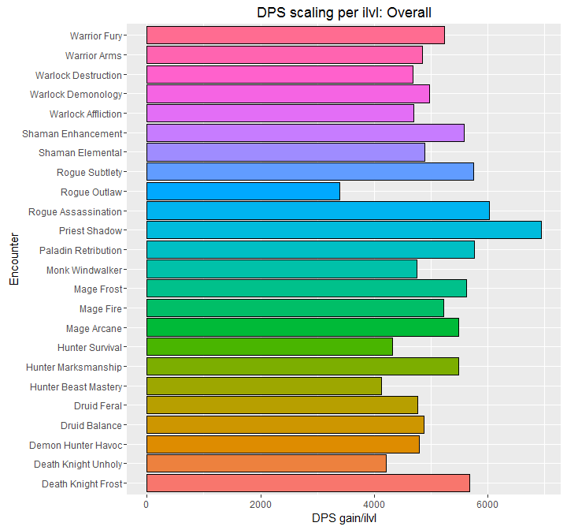

## How does my spec scale?

I initially started this project by wondering how well Outlaw rogues scaled relative to Assassination and Subtlety rogues. Community wisdom holds that Outlaw doesn't scale well, but why rely on that when we can go straight to the data? [WarcraftLogs](https://warcraftlogs.com) provides scads of data on the performance of various specs in prolonged raid encounters, long the "gold standard" of performance benchmarking.

The procedure is basically to pull the top 1,000 parses for each spec for each "bucket" of item levels from 840 to 880. Then, for an encounter, for each spec/ilvl bucket combo, we reject the top and bottom 5% of parses, and chart the data with a box plot, then fit it with both a local polynomial regression fitter and a linear regression fitter. This lets us eyeball how well a spec performs as gear levels increase.

We also plot the number of parses per ilvl per spec for the encounter, and provide plots of how well a spec scales over time (effectively, an approximation of the first derivative of the polynomial fit, taken by regressing against the deltas in the dataset), and finally, provide a very blunt linear regression per spec per encounter that attempts to compare how well spec X scales compared to spec Y for that encounter.

You'll find the code to grab and distill the data, as well as the RStudio notebooks used to generate this output at [https://github.com/cheald/warcraftlogs-parses](https://github.com/cheald/warcraftlogs-parses).

## tl;dr

* [Overall scaling, and per encounter](overall.html)

This shows the rate of change in DPS per ilvl gained, across the entire data set. This is *not* damage potential, but rather the rate of change of damage improvement as your gear improves.

While I initially started this project to find out if Outlaw scaled significantly worse than the other rogue specs, I found that not only is Outlaw the worst-scaling rogue spec, it's the worst-scaling raid spec overall, and by quite a large amount! Beast Mastery Hunters, Survival Hunters, and Unholy Death Knights suffer lower-than-average scaling, as well. On the other end of the scale, Shadow Priests, Assassination Rogues, and Retribution Paladins appear to have the strongest scaling, which aligns with common beliefs, as well.

## The parses

Below you'll find the parses for individual classes. While some classes (such as paladins and priests) don't have more than one damage spec, they are included for completeness.

* [Death Knight](death_knight.html)
* [Demon Hunter](demon_hunter.html)
* [Druid](druid.html)
* [Hunter](hunter.html)
* [Mage](mage.html)
* [Monk](monk.html)
* [Paladin](paladin.html)
* [Priest](priest.html)
* [Rogue](rogue.html)
* [Shaman](shaman.html)
* [Warlock](warlock.html)
* [Warrior](warrior.html)

